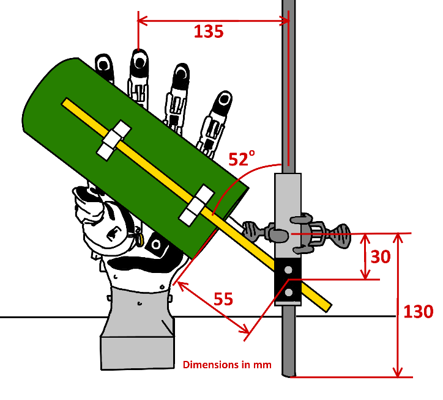
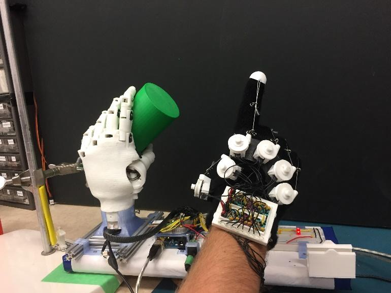
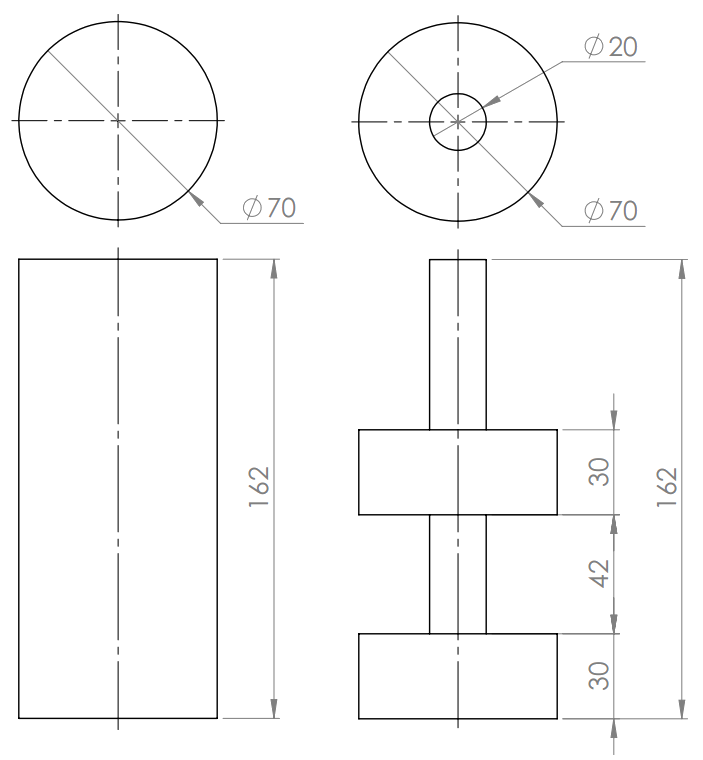

# Experiment

## Setup

- HANDi Hand mounted on Handi-Stand, next to pipet stand.
- Shapes mounted to pipet stand to easily and repeatably position within the grasp of the HANDi Hand.
- Shapes positioned in hand at angle of 52 degrees from vertical for a natural grasp
- HANDi Hand faces black posterboard to provide solid background for camera data.
- GLOVi Glove worn on user’s right hand.
- Arduino Mega to collect HANDi Hand signals and drive servos; separate Arduino Leonardo to collect GLOVi Glove signals.
- HANDi Hand signals coming in at 70ish Hz
- GLOVi Glove signals coming in at 750ish Hz
- Camera data coming in at 15 Hz, image size 480x640 RGB

## Procedue

- Recording starts.
- Each trial: Button press initiates trial start. Hand waits 2s, during which time the shape is rotated into the grasping area. Hand closes completely and waits 2s, during which time the experimenter makes signal using gloved hand. See table below. Hand opens after 2s, during which time the shape is rotated out of the grasping area, and field of view of the camera.
    - When not signalling, the gloved hand was returned to a fully extended position.
    - D0 on the HANDi Hand remained fully rotated inward in both open and closed positions; all other fingers flexed for closure and extended to open.
- Approximately 10 repetitions (trials) per episode, 3 episodes per object for a total of approximately 30 trials per object.
- All trials for each object were completed sequentially before moving to the next object.

| Object      | Trials          | Signal on GLOVi Glove | Fingers Flexed (glove) | Fingers Extended (glove) |
|-------------|-----------------|-----------------------|------------------------|--------------------------|
| Green Cyl   | 10+10+11 = 31   | One                   | D0, D1, D3, D4, D5     | D2                       |
| Orange Step | 9+11+10+3 = 33* | Two                   | D0, D1, D4, D5         | D2, D3                   |
| Green Step  | 11+11+11 = 33   | Three                 | D0, D1, D5             | D2, D3, D4               |
| Orange Cyl  | 12+10+12 = 34   | Four                  | D0, D1                 | D2, D3, D4, D5           |
* On trial 2 of episode 1, an unnamed experimenter forgot to signal with the glove when the hand closed, so a bonus episode of 3 trials was recorded.

The geometry of the shapes is given in the figure below. All shapes were 3d printed and weighed approx 70 grams.

## Data Recording
### Handihand
15 signals were read from the HANDi hand at 70 Hz in a comma seperated list over USB communication. The order of the list was:

button, thumb rot D0, thumb flex D1P, fake, thumb flex D1D, index D2P, index D2I, middle D3P, middle D3I, ring D4P, pinky D5P, FSR thumb, FSR index, FSR middle, FSR ring, FSR pinky

The fake signal was for a nonexistant Potentiometer.
As the data was read in by a python thread, the time that it was read was prepended onto the list and written to a .txt file.

### Gloviglove
A simiar approach was done for the GLOVi glove which had 6 signals reading at about 750 Hz. The order of the comma seperate list was :

thumb proximal, thumb distal, index, middle, ring, pinky

The data was read in by a seperate python thread, the time prepended to the list and written to a .txt file.

### Camera
The camera data was read by another python thread via OpenCV at a rate of about 15 Hz. Each 480x640x3 (color) frame was appended to an array and the time was recorded to a .txt file. To ensure that no data was lost due to file corruption and to limit the amount of data stored in RAM, if array contained 200 frames, it was converted to a numpy array and saved to disk with an appropriate section number in the filename. In this way, multiple sections could later be concatenated together to recreate the entire recorded video and could be time-matched with the Handihand and Gloviglove data via the timestamp recorded in the associated camera_times .txt file.

## Data Parsing

After manually and progromatically verifying all of the data, color histogram data was calculated for each color channel for each frame.
This resulted in 3 numbers valuing the of the average RGB of a frame.

The data was then merged using the glove data as a basis as it had the highest rate of recording. For each timestamp of the glove data, the most recent hand data and the most recent average (calculated by the cam_times.txt file) RGB values of the camera frames were appended together. Finally, using the handihand "button" as the indication of the start of a trial, 9 second trials were isolated and saved to disk.
 
